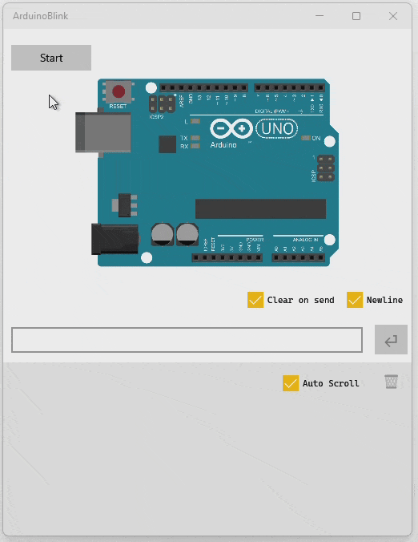

# ArduinoWindowsHost

A lightweight framework for hosting Arduino‑style sketches on Windows (WinRT/WinUI3/WPF).  
It provides an emulated environment with `setup()`, `loop()`, and `serialEvent()` support, plus serial I/O integration.

---

## Overview

`ArduinoWindowsHost` allows you to run Arduino sketches directly on Windows without hardware.  
It is designed for:

- Rapid prototyping of Arduino logic on desktop
- Debugging sketches with full Visual Studio tooling
- Integrating Arduino‑style code into UWP apps

---

## Example Project: ArduinoBlink

An example project, [ArduinoBlink](https://github.com/GitMoDu/ArduinoBlink), demonstrates how to use this host framework.

Features of the Blink sample:

- Implements `setup()`, `loop()`, and `serialEvent()`
- Toggles the built‑in LED and prints alternating Tick/Tock messages
- Provides a live UI with:
  - Arduino Uno board rendering
  - LED indicators (Power, Built‑In, TX, RX)
  - Integrated serial monitor with input/output
  - Start/Stop and Reset controls

---

## Getting Started

1. Clone this repository.
2. Add it as a dependency to your UWP / C++/WinRT project.
3. Subclass `LoopHost` to implement your Arduino‑style sketch.
4. Call `setup()`, `loop()`, and optionally `serialEvent()` as you would on hardware.

See the [ArduinoBlink example](https://github.com/GitMoDu/ArduinoBlink) for a complete reference.
